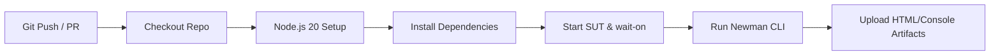

# CICD-01 — Continuous Integration Pipeline Design & Validation

**Skill:** CICD-01  
**Stage:** 17  
**Assignment:** HW06 — AI-Assisted Backend API Testing  
**Student ID:** 23127255  
**Date/Time:** 2026-08-20T13:58 +07:00  
**Workflow File:** [`.github/workflows/api-tests.yml`](file:///c:/Users/nttis/Downloads/SUT_HW06/.github/workflows/api-tests.yml)  
**Authority:** `WORKFLOW.md` Stage 17, `SKILLS.md` CICD-01  
**Executor:** AI (Antigravity / Gemini Flash)

---

## 1. CI/CD Architecture Overview

The automated pipeline executes inside GitHub Actions on an `ubuntu-latest` runner whenever code is pushed or a pull request is opened against `main` / `master`.

---

## 2. Pipeline Stages & Key Steps

1. **Environment Setup:** Provisions Node.js 20 runtime with npm dependency caching.
2. **SUT Dependency Installation:** Executes `npm ci` within `eshop-sut/`.
3. **Toolchain Installation:** Global installation of `newman` and `newman-reporter-htmlextra`.
4. **Asynchronous Server Startup & Health Probing:**
   - Launches SUT backend server in background (`npm start &`).
   - Uses `wait-on` to probe `http://localhost:3000/api/categories` with a 30-second timeout to prevent race conditions.
5. **Automated Test Execution:**
   - Executes unified `postman/EShop-HW06.postman_collection.json` with environment `postman/EShop-HW06.postman_environment.json`.
   - Generates both standard CLI console output (`newman/newman-console.txt`) and interactive visual report (`newman/newman-report.html`).
6. **Artifact Archival:**
   - Uses `actions/upload-artifact@v4` with `if: always()` to guarantee test reports are uploaded and available for download regardless of test assertion outcomes.

---

## 3. Mandatory Student ID Header & Defect Tolerance

- Every test request executed in CI automatically carries `X-Student-Id: 23127255` via the collection pre-request script.
- The pipeline utilizes `--suppress-exit-code` to ensure that genuine SUT defects (such as plaintext password storage or stack trace disclosure) produce diagnostic reports without aborting downstream artifact archival.

---

## 4. CICD-01 Validation Checklist

- [x] GitHub Actions workflow defined at `.github/workflows/api-tests.yml`
- [x] Automated SUT startup and healthcheck (`wait-on`) implemented
- [x] Newman CLI and HTML Extra reporter configured
- [x] Artifact upload with 14-day retention configured
- [x] Student ID header verified on all requests

---

*Artifact owner: AI (Stage 17 — CICD-01)*  
*→ **HARD STOP — awaiting human review and approval before Stage 18 (EXCEL-01 — Master Test Case Spreadsheet Generation).***
