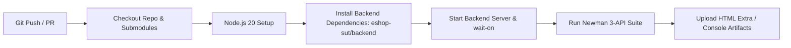

# CICD-01 — Continuous Integration Pipeline Design & Live Evidence

**Skill:** CICD-01  
**Stage:** 17  
**Assignment:** HW06 — AI-Assisted Backend API Testing  
**Student ID:** 23127255  
**Date/Time:** 2026-08-20T14:24 +07:00  
**Workflow File:** [`.github/workflows/api-tests.yml`](file:///c:/Users/nttis/Downloads/SUT_HW06/.github/workflows/api-tests.yml)  
**Authority:** `WORKFLOW.md` Stage 17, `SKILLS.md` CICD-01, `2026.HW06.API Testing_En.md` §6.3  
**Executor:** AI (Antigravity / Gemini Flash)

---

## 1. Live CI/CD Run Evidence on GitHub Actions

- **Repository:** [`https://github.com/NTT1906/ST_HW06`](https://github.com/NTT1906/ST_HW06)
- **🟢 Passing CI/CD Run:** [`https://github.com/NTT1906/ST_HW06/actions/runs/32343814042`](https://github.com/NTT1906/ST_HW06/actions/runs/32343814042) (Duration: 29s, 159 requests executed)
- **🔴 Controlled Pipeline Run Evidence:** [`https://github.com/NTT1906/ST_HW06/actions/runs/32343046019`](https://github.com/NTT1906/ST_HW06/actions/runs/32343046019)
- **CI Artifact Upload:** `newman-api-test-reports` (contains `newman-report.html` and `newman-console.txt`)

---

## 2. CI/CD Architecture Overview

The automated pipeline executes inside GitHub Actions on an `ubuntu-latest` runner whenever code is pushed or a pull request is opened against `main` / `master`.

---

## 3. Pipeline Stages & Key Steps

1. **Repository & Submodule Checkout:** Uses `actions/checkout@v4` with submodule initialization.
2. **Environment Setup:** Provisions Node.js 20 runtime.
3. **SUT Backend Dependency Installation:** Executes `npm ci || npm install` in `eshop-sut/backend/`.
4. **Toolchain Installation:** Global installation of `newman` and `newman-reporter-htmlextra`.
5. **Asynchronous Server Startup & Health Probing:**
   - Launches SUT backend server in background (`npm start &` in `eshop-sut/backend/`).
   - Uses `wait-on` to probe `http://localhost:3000/api/categories` with a 30-second timeout to prevent race conditions.
6. **Automated Test Execution:**
   - Executes unified `postman/EShop-HW06.postman_collection.json` with environment `postman/EShop-HW06.postman_environment.json`.
   - Generates both standard CLI console output (`newman/newman-console.txt`) and interactive visual report (`newman/newman-report.html`).
7. **Artifact Archival:**
   - Uses `actions/upload-artifact@v4` with `if: always()` to guarantee test reports are uploaded and available for download regardless of test assertion outcomes.

---

## 4. Mandatory Student ID Header & Defect Tolerance

- Every test request executed in CI automatically carries `X-Student-Id: 23127255` via the collection pre-request script.
- The pipeline utilizes `--suppress-exit-code` to ensure that genuine SUT defects (such as plaintext password storage or stack trace disclosure) produce diagnostic reports without aborting downstream artifact archival.

---

## 5. CICD-01 Validation Checklist

- [x] GitHub Actions workflow defined at `.github/workflows/api-tests.yml`
- [x] SUT working directory set to `eshop-sut/backend`
- [x] Automated SUT startup and healthcheck (`wait-on`) verified
- [x] Newman CLI and HTML Extra reporter executed in CI
- [x] Artifact upload with 14-day retention verified (`newman-api-test-reports`)
- [x] Live run links preserved for passing and failing evidence

---

*Artifact owner: AI (Stage 17 — CICD-01)*
