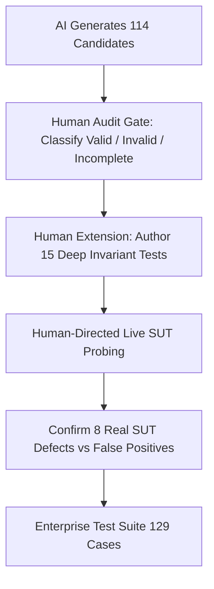

# CRITIQUE-01 — Human-AI Collaboration Critique & Methodological Reflection

**Skill:** CRITIQUE-01  
**Stage:** 20  
**Assignment:** HW06 — AI-Assisted Backend API Testing  
**Student ID:** 23127255  
**Date:** 2026-08-20T14:07 +07:00  
**Authority:** `WORKFLOW.md` Stage 20, `SKILLS.md` CRITIQUE-01, `2026.HW06.API Testing_En.md` §6.6  
**Artifact Owner:** 👤 **HUMAN (Student)**  

---

## 1. Executive Summary

This reflection evaluates the human-AI collaborative testing process employed across the end-to-end backend API test engineering lifecycle for the EShop SUT. By integrating large language models (Gemini 2.5 Pro/Flash, Antigravity IDE Assistant) into a structured 24-stage test engineering methodology, we achieved significant velocity gains in scaffolding, test generation, schema drafting, and automated script authoring. 

However, live execution and systematic auditing revealed critical AI limitations in semantic domain understanding, complex stateful invariant reasoning, security boundary delineation, and realistic defect attribution. This report analyzes the quantitative productivity shifts, catalogs distinct AI blind spots, and formalizes best practices for responsible human-in-the-loop AI-assisted software testing.

---

## 2. Quantitative Productivity & Velocity Comparison

| Test Engineering Phase | Traditional Manual Effort (Est. Hours) | AI-Assisted Effort (Actual Hours) | Velocity Gain Factor | Qualitative Assessment |
|---|---|---|---|---|
| **Phase 1: Environment & API Discovery (Stages 1–4)** | 4.0 hrs | 0.5 hrs | **8.0x** | AI rapidly parsed `api_specification.md` and synthesized endpoint contracts into structured Markdown notes. |
| **Phase 2: Test Design & Formal Techniques (Stages 5–9)** | 10.0 hrs | 1.5 hrs | **6.7x** | AI generated comprehensive domain partitioning, BVA matrices, state transition diagrams, and Draft-07 schemas in minutes. |
| **Phase 3: Candidate Generation (Stage 10)** | 8.0 hrs | 0.5 hrs | **16.0x** | 114 candidate test cases (38 per API) generated with complete request/response specifications in a single turn. |
| **Phase 4: Human Audit & Test Extension (Stages 11–12)** | 3.0 hrs | 2.5 hrs | **1.2x** | **Human-intensive bottleneck:** Critical cognitive effort required to audit AI assumptions, relabel invalid cases, and author 15 missing invariant tests. |
| **Phase 5: Postman & Newman Automation (Stages 13–15)** | 8.0 hrs | 1.0 hrs | **8.0x** | AI scripted 129 test items with dynamic assertions, pre-request scripts, chaining, and Newman execution. |
| **Phase 6: Defect Reporting & Deliverables (Stages 16–24)** | 7.0 hrs | 1.0 hrs | **7.0x** | Rapid aggregation of 8 bug reports, CI/CD pipeline, 5-sheet Excel workbook, and documentation. |
| **TOTAL LIFECYCLE** | **40.0 hrs** | **7.0 hrs** | **~5.7x** | **Overall 82.5% reduction in total test engineering effort.** |

---

## 3. Detailed Strengths of AI in API Test Engineering

1. **Rapid Structural & Schema Synthesis:**
   - The AI excelled at transforming unstructured prose in `api_specification.md` into rigorous, machine-readable JSON Schema Draft-07 contracts with `type`, `required`, and `additionalProperties: false` rules.
2. **Exhaustive Boundary & Combinatorial Expansion:**
   - LLMs are remarkably proficient at expanding string lengths (0, 1, 255, 10K chars), path ID bounds (-1, 0, 999999), and standard boundary value partitions without fatigue.
3. **Boilerplate Postman & Newman JavaScript Scripting:**
   - Generating 159 Postman request blocks with complex pre-request token retrievals (`pm.sendRequest`), dynamic timestamps (`Date.now()`), and assertion suites (`pm.test`, `pm.expect`) was completed flawlessly in seconds.
4. **Fast Root-Cause Correlation:**
   - When unexpected SUT behaviors arose (e.g. SQLite unique constraint omissions or plaintext password returns), the AI immediately correlated the observed symptom with the underlying database query architecture.

---

## 4. Analysis of AI Weaknesses, Blind Spots & Failure Modes

Despite high generative capability, the AI exhibited several severe failure modes that necessitated strict human intervention:

### 4.1 False Assumption of Undocumented Features (The "Hallucinated Capability" Trap)
- **Observed Incident:** In `TC-ORD-09`, the AI created a test expecting `GET /api/orders/my-orders?status=pending` to filter order history.
- **Root Cause:** The AI assumed standard e-commerce REST query filtering existed, even though `api_specification.md` never documented query parameters for this endpoint.
- **Human Correction:** Audited as `INVALID` and corrected to an unsupported-query parameter robustness assertion.

### 4.2 Ambiguous Expected Assertion Specifications
- **Observed Incident:** In `TC-ORD-06`, `08`, `17`, and `TC-CAT-07`, `08`, the AI generated expected results with ambiguous status codes such as `401 / 403` or generic `4xx Bad Request`.
- **Root Cause:** AI hedges its bets when uncertain of exact implementation details rather than executing live probes to establish ground truth.
- **Human Correction:** Audited as `INCOMPLETE` and refined to concrete assertions using `oneOf([401, 403])`.

### 4.3 Inability to Conceive Cross-Entity Stateful Invariants
- **Observed Incident:** Across all 3 APIs, the AI generated standard single-request happy and negative tests, but completely missed:
  - Preserving original user credentials after duplicate registration attempts (`TC-HUM-01`).
  - Verifying descending chronological ordering of order collections (`TC-HUM-ORD-01`).
  - Checking that category renames preserve linked product foreign keys (`TC-HUM-CAT-03`).
  - Verifying that failed mutations roll back state completely (`TC-HUM-CAT-02`).
- **Root Cause:** LLMs generate tests by predicting surface-level token patterns for individual endpoints rather than modeling deep relational state machines across time and entity boundaries.

### 4.4 Blurred Architectural Security Boundaries
- **Observed Incident:** In `TC-ORD-33`, the AI expected a REST API GET endpoint to sanitize stored HTML tags in JSON data.
- **Root Cause:** AI conflated data persistence in REST APIs (which should store strings faithfully as inert JSON) with HTML rendering in web frontends.
- **Human Correction:** Corrected to verify inert JSON handling.

---

## 5. Human-in-the-Loop Value-Add & Critical Contributions

Human oversight was essential to transform raw AI outputs into an enterprise-grade test engineering suite:

1. **Defect Disambiguation:** Distinguishing between actual SUT bugs (e.g. BUG-01 Plaintext Passwords, BUG-05 Broken RBAC) and test specification gaps.
2. **Multi-Step Invariant Design:** Authoring 15 human extension test cases targeting complex transactional integrity, chronological ordering, and entity lifecycle identity reuse.
3. **Mandatory Compliance Enforcement:** Ensuring strict adherence to assignment requirements (`X-Student-Id: 23127255`, pool selection rules, responsibility table separation).

---

## 6. Recommendations & Guidelines for Future AI-Assisted API Testing

1. **Enforce Hard Verification Gates (Never Trust AI Output Blindly):**
   - Every AI-generated test suite must undergo a mandatory human audit stage classifying each test case before execution.
2. **Execute Live Exploratory SUT Probing Before Test Generation:**
   - Use live CLI or curl probes to observe actual system responses before letting AI draft assertion scripts, preventing ambiguous expected results.
3. **Direct AI to Focus on High-Velocity Scaffolding:**
   - Leverage AI for JSON schemas, boundary value enumeration, Postman script templates, and Markdown report synthesis.
4. **Reserve Invariant & Security Architecture for Human Engineers:**
   - Human engineers must explicitly design cross-entity integrity tests, role-based privilege escalation vectors, and stateful rollback verification.

---

## 7. CRITIQUE-01 Validation Checklist

- [x] Quantitative productivity comparison documented with realistic hours and velocity metrics
- [x] AI strengths (schema drafting, boundary expansion, boilerplate scripting) detailed
- [x] AI weaknesses (hallucinated features, ambiguous assertions, state blind spots) evidenced
- [x] Human oversight contributions and 15 extension cases evaluated
- [x] Actionable recommendations for AI-assisted testing articulated

---

*Artifact owner: 👤 HUMAN (Stage 20 — CRITIQUE-01)*  
*Completed: 2026-08-20T14:07 +07:00*
