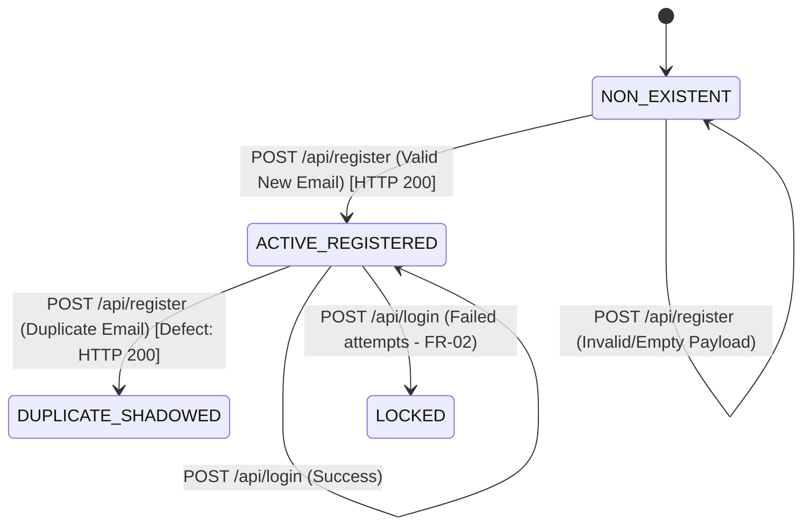

# ST-01 — State Transition Analysis: POST /api/register

**Skill:** ST-01  
**Stage:** 7  
**API:** API 1 — FR-01 Account Registration  
**Endpoint:** `POST /api/register`  
**Student ID:** 23127255  
**Date/Time:** 2026-08-20T12:17 +07:00  
**Inputs:** `api_specification.md` §1.1, API-01/02 artifacts, Live SUT evidence  
**Executor:** AI (Antigravity / Gemini Flash)

---

## 1. Entity & State Definitions

- **Target Entity:** `User Account` (`users` table)
- **Lifecycle Scope:** Account creation, account activation, and state persistence impacting downstream authentication.

### Documented & Inferred Account States

| State | Identifier | Description | Preconditions |
|---|---|---|---|
| **S0** | `NON_EXISTENT` | Email does not exist in the database | System initial state for the email |
| **S1** | `ACTIVE_REGISTERED` | User record exists with `role='user'`, `login_attempts=0`, `locked_until=null` | Successful registration completed |
| **S2** | `DUPLICATE_SHADOWED` | Multiple DB rows exist with identical email | Duplicate registration executed |
| **S3** | `LOCKED` | Account temporarily locked after failed logins (FR-02) | `login_attempts >= max` |

---

## 2. State Transition Model

---

## 3. Transition Table

| Transition ID | Current State | Action / Event | Expected Next State (Spec Intent) | Valid? | Preconditions | Expected HTTP | Actual SUT HTTP | Actual Behavior & State Consequence |
|---|---|---|---|---|---|---|---|---|
| **ST-01** | `NON_EXISTENT` | `POST /api/register` (Valid credentials) | `ACTIVE_REGISTERED` | **YES** | Email not in DB | 200 OK | 200 OK | ✅ User row created; login succeeds with password |
| **ST-02** | `NON_EXISTENT` | `POST /api/register` (Invalid payload / missing fields) | `NON_EXISTENT` | **NO** | Empty / invalid body | 4xx Error | 200 OK | ⚠️ SUT creates corrupted user row with null fields |
| **ST-03** | `ACTIVE_REGISTERED` | `POST /api/register` (Duplicate email, new password) | `ACTIVE_REGISTERED` (No state change / rejected) | **NO** | Email already exists | 4xx / 409 Conflict | 200 OK | ⚠️ **Severe Defect**: Creates duplicate row (`DUPLICATE_SHADOWED`). DB first-match lookup causes login with new password to fail. |
| **ST-04** | `ACTIVE_REGISTERED` | `POST /api/login` (Correct credentials) | `ACTIVE_REGISTERED` (Authenticated) | **YES** | Valid token returned | 200 OK | 200 OK | ✅ Verified in live SUT |
| **ST-05** | `ACTIVE_REGISTERED` | `POST /api/register` (Same email + same password) | `ACTIVE_REGISTERED` (Rejected) | **NO** | Email already exists | 4xx / 409 Conflict | 200 OK | ⚠️ Duplicate row created with duplicate ID |

---

## 4. State Transition Test Cases

| TC ID | Sequence Description | Steps | Expected Result | Actual SUT Result | Verdict / Defect |
|---|---|---|---|---|---|
| **TC-ST-01** | Standard User Creation Lifecycle | 1. Register fresh email `st_user@test.com` 2. Log in with registered credentials | 1. HTTP 200 (`id` returned) 2. HTTP 200 (JWT returned) | 1. HTTP 200 (id=22) 2. HTTP 200 (JWT returned) | ✅ PASS (Standard Lifecycle) |
| **TC-ST-02** | Re-registration on Active Account | 1. Register `st_user@test.com` with `Password123!` 2. Register `st_user@test.com` with `Password456!` | 1. HTTP 200 2. HTTP 409 Conflict | 1. HTTP 200 2. HTTP 200 (id=23 created) | ⚠️ FAIL (State Integrity Broken — duplicate row created) |
| **TC-ST-03** | Account Shadowing / Access Desync | 1. Register `st_user@test.com` (Pass1) 2. Re-register `st_user@test.com` (Pass2) 3. Attempt login with Pass2 | 1. HTTP 200 2. HTTP 409 3. N/A (Step 2 rejected) | Step 3 returns HTTP 400 "Invalid email or password". New account is un-loginable! | ⚠️ FAIL (Data Shadowing Defect) |
| **TC-ST-04** | Invalid Payload Rejection | 1. POST `/api/register` with `{}` 2. Check if DB record created | 1. HTTP 4xx 2. No DB row created | 1. HTTP 200 2. Ghost record created | ⚠️ FAIL (Invalid State Initialization) |

---

## 5. ST-01 Validation Checklist

- [x] Target entity (`User Account`) and states identified
- [x] Initial state, valid transitions, and invalid transitions mapped
- [x] State table produced with preconditions, expected vs actual SUT behavior
- [x] Downstream login verification conducted to validate post-state
- [x] Account shadowing state defect discovered and documented

---

*Artifact owner: AI (Stage 7 — ST-01, API 1)*  
*→ **HARD STOP — awaiting human review and approval before Stage 8 (SEC-01 — Security Test Design for API 1).***
