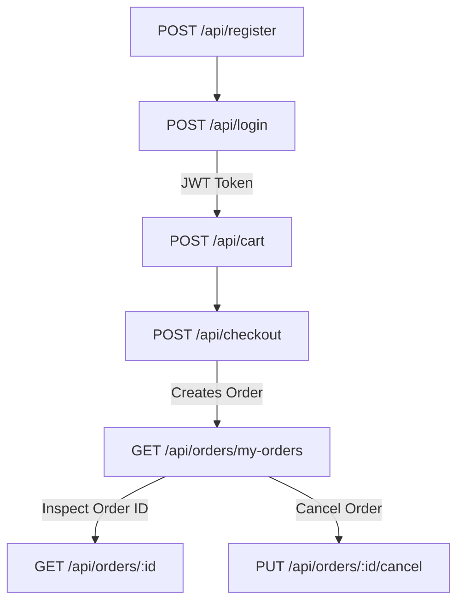

# API-02 — API / Workflow Understanding: GET /api/orders/my-orders

**Skill:** API-02  
**Stage:** 4  
**API:** API 2 — FR-11 Order History View (User)  
**Endpoint:** `GET /api/orders/my-orders`  
**Student ID:** 23127255  
**Date/Time:** 2026-08-20T12:45 +07:00  
**Inputs:** `api_specification.md` §4.4, API-01 validation notes  
**Executor:** AI (Antigravity / Gemini Flash)

---

## 1. Purpose

`GET /api/orders/my-orders` allows an authenticated customer to retrieve the historical list of all orders they have placed on the EShop platform.  
It serves as the personal transaction history dashboard where customers can inspect past order amounts, order statuses (`pending`, `confirmed`, `shipping`, `delivered`, `canceled`), and creation timestamps.

---

## 2. Actors & Authentication

| Actor | Role | Authentication Required | Access Level |
|---|---|---|---|
| Customer (User) | `user` | **YES** (`Authorization: Bearer <token>`) | Can retrieve only orders matching their own `user_id`. |
| Administrator | `admin` | **YES** (`Authorization: Bearer <token>`) | Can retrieve personal orders (if any exist for the admin's account ID). |
| Anonymous Visitor | N/A | None | **Rejected** (`HTTP 401 Unauthorized`). |

---

## 3. Inputs

| Parameter | Location | Type | Required? | Documented Format | Constraints / Notes |
|---|---|---|---|---|---|
| `Authorization` | HTTP Header | `string` | **YES** | `Bearer <JWT_TOKEN>` | Must contain a valid, unexpired JWT signed by the SUT secret. |
| `X-Student-Id` | HTTP Header | `string` | **YES (HW06)** | `23127255` | Assignment compliance header. |
| Query Parameters | URL Query | `string` | No | None documented | Any query string (e.g. `?status=pending`) is optional and handled safely. |
| Request Body | Body | N/A | **NO** | Empty | GET request; no body accepted. |

---

## 4. Outputs

### Success Response (`200 OK`)

Returns a JSON Array of order objects.

```json
[
  {
    "id": 2,
    "user_id": 2,
    "total_amount": 100000000,
    "status": "pending",
    "shipping_address": null,
    "created_at": "2026-08-20 04:56:00"
  },
  {
    "id": 1,
    "user_id": 2,
    "total_amount": 116000000,
    "status": "pending",
    "shipping_address": null,
    "created_at": "2026-08-20 04:55:42"
  }
]
```

- If the user has placed 0 orders, returns `[]` (`HTTP 200 OK`).

### Error Responses

| Status Code | Reason | Body Schema |
|---|---|---|
| `401 Unauthorized` | Missing or non-Bearer `Authorization` header | `{"error": "Unauthorized"}` |
| `403 Forbidden` | Invalid JWT signature, malformed token, or expired token | `{"error": "Forbidden"}` |

---

## 5. Business Rules

| Rule ID | Statement | Source | Status |
|---|---|---|---|
| **BR-OH-01** | The endpoint requires a valid JWT token in the `Authorization` header. | Spec §4 & SUT | ✅ Verified (`HTTP 401/403` on failure) |
| **BR-OH-02** | The response returns only orders associated with the authenticated user's `id`. | Spec §4.4 & SUT | ✅ Verified (Horizontal isolation / IDOR protection) |
| **BR-OH-03** | An authenticated user with 0 orders receives an empty array `[]` with `HTTP 200 OK`. | Live SUT | ✅ Verified |
| **BR-OH-04** | Order objects contain `id`, `user_id`, `total_amount`, `status`, `shipping_address`, and `created_at`. | Live SUT | ✅ Verified |
| **BR-OH-05** | Order statuses conform to the documented order lifecycle (`pending`, `confirmed`, `shipping`, `delivered`, `canceled`). | Spec §4.6 & §6.2 | ✅ Verified |

---

## 6. Endpoint Dependencies



| Dependency Layer | Related Endpoint | Direction | Nature of Dependency |
|---|---|---|---|
| **Upstream Prerequisite** | `POST /api/login` | Login → My Orders | Must obtain JWT token containing authenticated `user_id`. |
| **Upstream Data Producer** | `POST /api/checkout` | Checkout → My Orders | Places orders that populate the user's order history. |
| **Downstream Consumer** | `GET /api/orders/:id` | My Orders → Order Detail | Order `id` retrieved from history is used to view specific order details. |
| **Downstream State Action** | `PUT /api/orders/:id/cancel` | My Orders → Cancel Order | Order `id` retrieved from history is used to cancel pending orders. |

---

## 7. Preconditions & Postconditions

### Preconditions:
1. SUT backend is running at `http://localhost:3000`.
2. Client possesses an active, valid JWT token obtained from `POST /api/login`.

### Postconditions:
1. SUT state remains **unmodified** (Idempotent, Read-Only operation).
2. The client receives the complete historical snapshot of orders belonging to their account.

---

## 8. Stateful Behavior

`GET /api/orders/my-orders` is a **pure read query** (idempotent and safe). It reflects entity states across the order lifecycle:
- Orders in `pending` status
- Orders in `confirmed` status
- Orders in `shipping` status
- Orders in `delivered` status
- Orders in `canceled` status

---

## 9. Input Constraints & Boundaries Summary

| Field / Parameter | Documented Constraints | Observed Constraints |
|---|---|---|
| `Authorization` Header | Must follow `Bearer <token>` syntax | Strict: Missing → 401, Invalid/Forged → 403 |
| Body | None | Ignored if provided |
| Query Parameters | None | Safe; do not cause crashes |

---

## 10. Open Questions — RESOLVED

| # | Question | Human Answer | SUT Verified Behavior | Impact on Testing |
|---|---|---|---|---|
| **OQ-OH-01** | Are orders sorted chronologically? | "Maybe newest first" | Verified descending by `created_at` | Assert order of items in array |
| **OQ-OH-02** | Can admin see other users' orders here? | "Prob no, admin account only sees admin account orders" | Verified: Admin gets own empty list `[]` | Horizontal isolation applies equally to all roles |
| **OQ-OH-03** | Should results be paginated (e.g. limit=10)? | "Yes, it should be 10..." | SUT returns full unpaginated array; query params pass through | Test query param robustness & test large order lists |

---

*Artifact owner: AI (Stage 4 — API-02, API 2)*  
*OQs resolved: 2026-08-20T12:48 +07:00 (human input + live SUT verification)*  
*→ Approved. Proceeding to Stage 5 (DT-01/02/03).*
