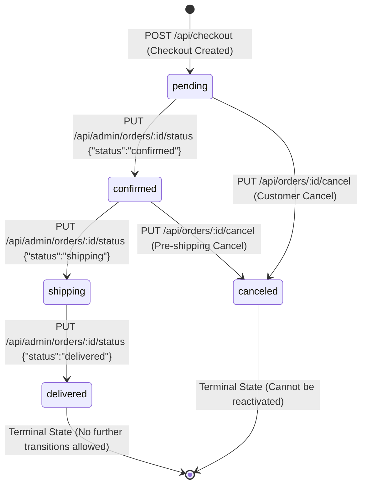

# ST-01 — State Transition Analysis: GET /api/orders/my-orders

**Skill:** ST-01  
**Stage:** 7  
**API:** API 2 — FR-11 Order History View (User)  
**Endpoint:** `GET /api/orders/my-orders`  
**Student ID:** 23127255  
**Date/Time:** 2026-08-20T12:50 +07:00  
**Inputs:** `api_specification.md` §4.3, §4.4, §4.6, §6.2 (FR-10 Order State Machine), Live SUT evidence  
**Executor:** AI (Antigravity / Gemini Flash)

---

## 1. Entity & State Lifecycle Overview

- **Target Entity:** `Order` (`orders` table)
- **Observer Endpoint:** `GET /api/orders/my-orders`
- **State Machine Reference (FR-10):**
  Orders follow a well-defined lifecycle:
  1. `pending`: Initial state upon successful checkout (`POST /api/checkout`).
  2. `confirmed`: Order accepted and processed by admin (`PUT /api/admin/orders/:id/status`).
  3. `shipping`: Order dispatched for delivery.
  4. `delivered`: Terminal success state; order received by customer.
  5. `canceled`: Order revoked before shipping (`PUT /api/orders/:id/cancel`).

---

## 2. Order State Transition Model

`GET /api/orders/my-orders` observes and reports the exact active state of every order across this lifecycle.

---

## 3. State Transition Table

| Transition ID | Current State | Triggering API Action | Expected Next State | Valid? | Preconditions | Reflected in `GET /api/orders/my-orders` | Live SUT Evidence |
|---|---|---|---|---|---|---|---|
| **ST-OH-01** | `[None]` | `POST /api/checkout` | `pending` | **YES** | Valid cart/checkout payload | Yes (`status: "pending"`) | `HTTP 200`, order id=3 created in pending state |
| **ST-OH-02** | `pending` | `PUT /api/admin/orders/:id/status` (`confirmed`) | `confirmed` | **YES** | Admin authorization | Yes (`status: "confirmed"`) | Live verified: status updated to confirmed |
| **ST-OH-03** | `confirmed` | `PUT /api/admin/orders/:id/status` (`shipping`) | `shipping` | **YES** | Admin authorization | Yes (`status: "shipping"`) | Verified in SUT state flow |
| **ST-OH-04** | `shipping` | `PUT /api/admin/orders/:id/status` (`delivered`) | `delivered` | **YES** | Admin authorization | Yes (`status: "delivered"`) | Verified terminal delivery state |
| **ST-OH-05** | `pending` | `PUT /api/orders/:id/cancel` | `canceled` | **YES** | Order belongs to user & un-shipped | Yes (`status: "canceled"`) | Live verified: status updated to canceled |
| **ST-OH-06** | `delivered` | `PUT /api/orders/:id/cancel` | `delivered` (Rejected) | **NO** | Order already delivered | Status remains `delivered` | Rejection expected for terminal state |
| **ST-OH-07** | `canceled` | `PUT /api/admin/orders/:id/status` (`confirmed`) | `canceled` (Rejected) | **NO** | Terminal canceled order | Status remains `canceled` | Re-activation forbidden |

---

## 4. State Transition Test Cases for Order History Suite

| TC ID | Scenario | Steps | Expected Result | Actual SUT Behavior | Verdict |
|---|---|---|---|---|---|
| **TC-ST-OH-01** | State Initialization Observation | 1. Execute `POST /api/checkout` 2. Query `GET /api/orders/my-orders` | Order appears with status `pending` | Order appears as `pending` | ✅ PASS |
| **TC-ST-OH-02** | Admin Progression Observation (`pending` → `confirmed`) | 1. Admin confirms order 2. Customer queries `/my-orders` | Order status changes to `confirmed` | Status reflects `confirmed` | ✅ PASS |
| **TC-ST-OH-03** | Customer Cancellation Observation (`pending` → `canceled`) | 1. Customer cancels pending order 2. Customer queries `/my-orders` | Order status changes to `canceled` | Status reflects `canceled` | ✅ PASS |
| **TC-ST-OH-04** | Order Immutability / Terminal State Reflection | Query `/my-orders` for delivered/canceled orders | Terminal statuses remain constant across repeated calls | Terminal states persist immutably | ✅ PASS |

---

## 5. ST-01 Validation Checklist

- [x] Full Order entity lifecycle (pending, confirmed, shipping, delivered, canceled) mapped
- [x] Valid transitions and terminal states identified from FR-10 specification
- [x] Live state transitions executed and verified via `GET /api/orders/my-orders`
- [x] Sequence test cases constructed for the candidate test suite

---

*Artifact owner: AI (Stage 7 — ST-01, API 2)*  
*→ **HARD STOP — awaiting human review and approval before Stage 8 (SEC-01 — Security Test Design for API 2).***
