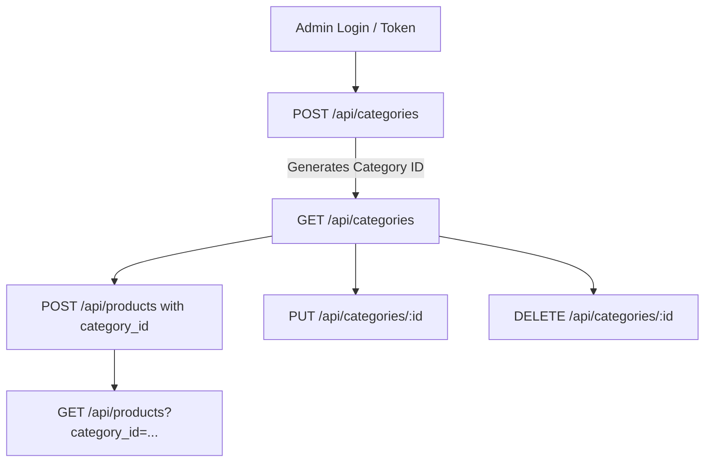

# API-02 — API / Workflow Understanding: Product Categories (FR-14)

**Skill:** API-02  
**Stage:** 4  
**API:** API 3 — FR-14 Product Categories  
**Endpoint:** `GET /api/categories` (and associated Category CRUD: `POST`, `PUT`, `DELETE`)  
**Student ID:** 23127255  
**Date/Time:** 2026-08-20T13:23 +07:00  
**Inputs:** `api_specification.md` §3.4, API-01 validation notes  
**Executor:** AI (Antigravity / Gemini Flash)

---

## 1. Purpose

The Product Categories API manages the catalog taxonomies that group products in the EShop storefront:
1. **Public Browsing:** Anonymous and authenticated users retrieve the active category directory via `GET /api/categories` to navigate the catalog.
2. **Catalog Administration:** Administrators create (`POST /api/categories`), update (`PUT /api/categories/:id`), and remove (`DELETE /api/categories/:id`) categories.

---

## 2. Actors & Authentication Requirements

| Action | Endpoint | Expected Actor Role | Expected Auth | SUT Observed Enforcement |
|---|---|---|---|---|
| List Categories | `GET /api/categories` | Public (Anyone) | None | Public (`200 OK`) |
| Create Category | `POST /api/categories` | Administrator (`role: "admin"`) | Bearer JWT | Requires JWT, but **fails SEC-03: accepts regular user token** |
| Update Category | `PUT /api/categories/:id` | Administrator (`role: "admin"`) | Bearer JWT | Requires JWT, fails SEC-03 (accepts user token) |
| Delete Category | `DELETE /api/categories/:id` | Administrator (`role: "admin"`) | Bearer JWT | Requires JWT, fails SEC-03 (accepts user token) |

---

## 3. Inputs

### For `GET /api/categories`:
- **HTTP Header:** `X-Student-Id: 23127255`
- **Query / Body:** None

### For `POST /api/categories`:
- **HTTP Headers:** `Authorization: Bearer <token>`, `Content-Type: application/json`, `X-Student-Id: 23127255`
- **Request Body (JSON):**
  - `name` (string, required): The display name of the category (e.g. `"Điện thoại"`).

### For `PUT /api/categories/:id`:
- **Path Parameter:** `:id` (integer)
- **Request Body (JSON):** `name` (string, required)

### For `DELETE /api/categories/:id`:
- **Path Parameter:** `:id` (integer)

---

## 4. Outputs

### Success (`GET /api/categories` — 200 OK)
Array of category objects: `[{"id": 1, "name": "Điện thoại"}, ...]`

### Success (`POST /api/categories` — 200 OK)
`{"message": "Category created", "id": <integer>}`

### Success (`PUT /api/categories/:id` — 200 OK)
`{"message": "Category updated"}`

### Success (`DELETE /api/categories/:id` — 200 OK)
`{"message": "Category deleted"}`

### Error Responses
- `401 Unauthorized`: Missing `Authorization` header on mutation endpoints.
- `403 Forbidden`: Invalid JWT signature (intended: also for non-admin tokens per SEC-03).

---

## 5. Business Rules

| Rule ID | Rule Statement | Documented Spec | SUT Reality | Status |
|---|---|---|---|---|
| **BR-CAT-01** | `GET /api/categories` is public and returns all available categories. | Spec §3.4 | Verified HTTP 200 | ✅ Verified |
| **BR-CAT-02** | Category creation, modification, and deletion are restricted to Admin role. | Spec §3.3/3.4 & SEC-03 | SUT permits regular user role | 🚨 **BROKEN (SEC-03 Defect)** |
| **BR-CAT-03** | Category creation requires a non-empty `name` string. | Spec §3.4 | SUT accepts `{}` and saves `null` | ⚠️ **BROKEN (Validation Defect)** |
| **BR-CAT-04** | Products link to categories via `category_id`. | Spec §3.3 | Verified foreign key relationship | ✅ Verified |

---

## 6. Endpoint Dependencies

---

## 7. Preconditions & Postconditions

- **Preconditions for `GET /api/categories`:** SUT backend running.
- **Postconditions for `GET /api/categories`:** Read-only (idempotent, safe).
- **Postconditions for Category Mutations:** Inserts, modifies, or removes a record in the `categories` SQLite table.

---

## 8. Stateful Behavior

Categories transition through standard entity lifecycle states:
1. `Non-Existent`
2. `Active` (Created via `POST /api/categories`, visible in `GET /api/categories`)
3. `Updated` (Modified via `PUT /api/categories/:id`)
4. `Deleted` (Removed via `DELETE /api/categories/:id`, no longer appears in `GET /api/categories`)

---

## 9. Open Questions — RESOLVED

| # | Question | Human Decision / Finding | SUT Observed Reality | Impact on Testing |
|---|---|---|---|---|
| **OQ-CAT-01** | Should category names be unique? | **RESOLVED:** Category names are NOT unique in the current SUT. The API/database allows multiple categories with the same name and assigns different IDs. | SUT returns HTTP 200 and assigns new ID for duplicate names. | Treat duplicate category names as a confirmed defect candidate to be covered in test suite. |
| **OQ-CAT-02** | What happens when deleting a category with linked products? | **RESOLVED via SUT Execution:** Deleting a category does NOT cascade-delete or nullify linked products. | Category is deleted (HTTP 200), and linked products retain their original `category_id`, resulting in orphaned product foreign keys. | Design state transition and data-integrity tests covering orphaned category references. |

---

*Artifact owner: AI (Stage 4 — API-02, API 3)*  
*OQs updated: 2026-08-20T13:27 +07:00 (human review & live SUT execution)*  
*→ Approved. Proceeding to Stage 5 (DT-01/02/03).*
