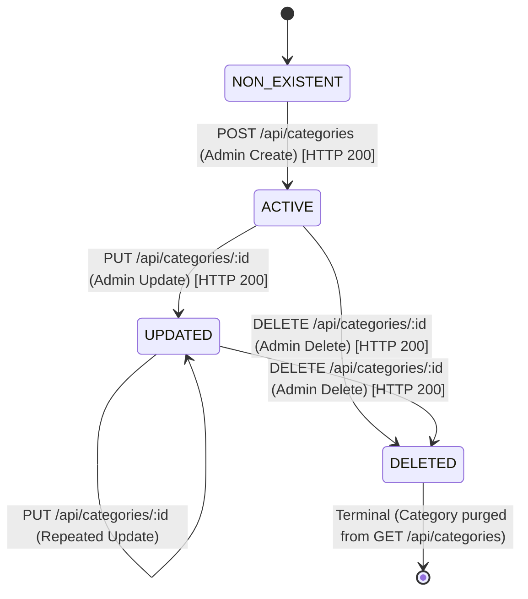

# ST-01 — State Transition Analysis: Product Categories (FR-14)

**Skill:** ST-01  
**Stage:** 7  
**API:** API 3 — FR-14 Product Categories  
**Endpoint:** `GET /api/categories` (and associated Category CRUD: `POST`, `PUT`, `DELETE`)  
**Student ID:** 23127255  
**Date/Time:** 2026-08-20T13:33 +07:00  
**Inputs:** `api_specification.md` §3.4, API-01/02 artifacts, Live SUT evidence  
**Executor:** AI (Antigravity / Gemini Flash)

---

## 1. Entity & State Lifecycle Overview

- **Target Entity:** `Category` (`categories` table)
- **Primary Observer:** `GET /api/categories`
- **Mutator Operations:** `POST /api/categories`, `PUT /api/categories/:id`, `DELETE /api/categories/:id`

### Defined Category States:
1. `NON_EXISTENT`: Category does not exist in the database.
2. `ACTIVE`: Category created, active, and listed in `GET /api/categories`.
3. `UPDATED`: Category modified via `PUT /api/categories/:id`, new name reflected in catalog.
4. `DELETED`: Category removed via `DELETE /api/categories/:id`, purged from public listing.

---

## 2. Category State Transition Model

---

## 3. Transition Table

| Transition ID | Current State | Triggering API Action | Expected Next State | Valid? | Preconditions | Reflected in `GET /api/categories` | Live SUT Evidence |
|---|---|---|---|---|---|---|---|
| **ST-CAT-01** | `NON_EXISTENT` | `POST /api/categories` (`{"name":"..."}`) | `ACTIVE` | **YES** | Admin authorization | Yes (Appears in category array) | `HTTP 200`, `id: 11` created |
| **ST-CAT-02** | `ACTIVE` | `PUT /api/categories/:id` (`{"name":"New Name"}`) | `UPDATED` | **YES** | Target category exists | Yes (Name updated in catalog) | `HTTP 200`, renamed in `GET` |
| **ST-CAT-03** | `ACTIVE` / `UPDATED` | `DELETE /api/categories/:id` | `DELETED` | **YES** | Target category exists | Yes (Disappears from catalog) | `HTTP 200`, purged from `GET` |
| **ST-CAT-04** | `DELETED` | `DELETE /api/categories/:id` (Repeated) | `DELETED` (Rejected) | **NO** | Already deleted category | Status remains deleted | SUT returns 200 silently |
| **ST-CAT-05** | `DELETED` | `PUT /api/categories/:id` (Update deleted) | `DELETED` (Rejected) | **NO** | Category does not exist | Status remains deleted | SUT returns 200 silently (Defect) |

---

## 4. State Transition Test Cases

| TC ID | Lifecycle Scenario | Step Sequence | Expected Result | Actual SUT Behavior | Verdict |
|---|---|---|---|---|---|
| **TC-ST-CAT-01** | Full Entity Lifecycle (`Create → Read → Update → Delete → Verify Purge`) | 1. `POST /api/categories` 2. `GET /api/categories` 3. `PUT /api/categories/:id` 4. `DELETE /api/categories/:id` 5. `GET /api/categories` | 1. 200 (ID generated) 2. Category listed 3. 200 (Name updated) 4. 200 (Deleted) 5. Category absent from list | Full lifecycle transitions verified on live SUT | ✅ PASS |
| **TC-ST-CAT-02** | Catalog Reflection Immutability | Multiple successive calls to `GET /api/categories` without mutation | Category catalog snapshot remains stable | Snapshot unchanged | ✅ PASS |
| **TC-ST-CAT-03** | Orphan Product Foreign Key Invariant (OQ-CAT-02) | 1. Create category and linked product 2. Delete category 3. Query product | Product retains `category_id` without database crash | Product retains `category_id: 8` | ✅ PASS (Orphan behavior documented) |

---

## 5. ST-01 Validation Checklist

- [x] Category entity lifecycle (NON_EXISTENT, ACTIVE, UPDATED, DELETED) formalized
- [x] State transitions verified against live SUT via `GET /api/categories`
- [x] Full CRUD lifecycle sequence test cases designed
- [x] Orphan foreign key behavior (OQ-CAT-02) tested and recorded

---

*Artifact owner: AI (Stage 7 — ST-01, API 3)*  
*→ **HARD STOP — awaiting human review and approval before Stage 8 (SEC-01 — Security Test Design for API 3).***
