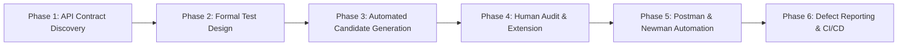

# API Test Toolkit Skill (`AGY-SKILL-01`)

This skill provides an end-to-end, standardized workflow for Antigravity AI agents to perform systematic, enterprise-grade backend API testing on any RESTful web service.

---

## 1. Overview & Capability Matrix

When activated, this skill guides the agent through the complete 6-phase API test engineering pipeline:



---

## 2. Step-by-Step Execution Workflow

### Step 1: API Discovery & Live Endpoint Probing (`API-01`, `API-02`)
1. Inspect the target API specification document (`api_specification.md` or OpenAPI/Swagger JSON).
2. Execute live HTTP probes using curl or PowerShell `Invoke-WebRequest` to verify active routes, required headers, authentication schemes, and actual response payload formats.
3. Identify actors, authentication tokens, preconditions, postconditions, and document open questions.

### Step 2: Formal Test Technique Modeling (`DT-01–03`, `BVA-01`, `ST-01`)
1. **Domain Identification & Partitioning (DT):**
   - Identify all input variables (path, query, headers, body).
   - Divide into mutually exclusive Valid (`V`) and Invalid (`IV`) equivalence partitions.
2. **Boundary Value Analysis (BVA):**
   - Test boundaries: Min - 1, Min, Nominal, Max, Max + 1, and Extreme Buffer (DoS resilience).
   - Numeric path ID bounds (-1, 0, 1, 999999).
3. **State Transition Modeling (ST):**
   - Formalize entity state lifecycle: `NON_EXISTENT` → `ACTIVE` → `UPDATED` → `DELETED`.
   - Verify that mutations are immediately visible in collection endpoints (`GET`).

### Step 3: Security & Schema Contract Design (`SEC-01`, `SCHEMA-01`)
1. **Security Testing Matrix (SEC-01–07):**
   - `SEC-01`: Plaintext password storage and response leak checks.
   - `SEC-02`: Missing / forged JWT authentication (`alg: "none"`) rejection.
   - `SEC-03`: Role-based access control (RBAC) enforcement (`role === 'admin'`).
   - `SEC-04`: Stored and Reflected XSS sanitization in input fields.
   - `SEC-05`: Parameterized SQL injection query safety.
   - `SEC-06`: Horizontal access control / IDOR protection across distinct user identities.
2. **Response Schema Validation (SCHEMA-01):**
   - Write JSON Schema Draft-07 models with strict types, required keys, and `additionalProperties: false`.

### Step 4: Candidate Test Case Generation (`AI-GEN-01`)
- Generate ≥ 35 structured candidate test cases per endpoint across DT, BVA, ST, SEC, and SCHEMA.
- Structure each case with: `TC ID`, `Technique`, `Scenario Title`, `Preconditions`, `Method`, `Path`, `Headers`, `Body`, `Expected HTTP`, `Expected Response`, and `Rationale`.

### Step 5: Human Audit & Invariant Extension (`AUDIT-02`, `EXTEND-01`)
> ⚠️ **Mandatory Human-in-the-Loop Gate:** The agent must halt and request human review.
- Human audits all candidates: classifies as `VALID`, `INVALID`, or `INCOMPLETE`.
- Human authors ≥ 5 complex invariant extension cases (e.g. cross-entity referential integrity, chronological ordering, state rollback on error).

### Step 6: Postman & Newman Automation (`POSTMAN-01`, `NEWMAN-01`, `CICD-01`)
1. Compile test suite into a Postman Collection JSON (v2.1.0) with:
   - Collection-level pre-request scripts for dynamic student ID injection (`X-Student-Id`).
   - Request-level pre-request scripts for dynamic emails (`Date.now()`) and sub-requests (`pm.sendRequest`).
   - Advanced test assertions (`pm.response.to.have.jsonSchema()`, `pm.expect()`).
2. Run automated headless execution via Newman CLI:
   ```bash
   newman run postman/collection.json \
     -e postman/environment.json \
     --reporters "cli,htmlextra" \
     --reporter-htmlextra-export newman/newman-report.html
   ```
3. Generate CI/CD workflow (`.github/workflows/api-tests.yml`) with automated server startup and health polling (`wait-on`).

### Step 7: Master Excel & Defect Reporting (`EXCEL-01`, `BUG-01`)
- Generate a 5-sheet master workbook (`excel/TestCases.xlsx`) with Overview, Per-API sheets, and Defect Catalogs.
- Document confirmed SUT bugs with severity, reproduction steps, root cause analysis, and code remediations.

---

## 3. Postman Assertion Script Cheatsheet

### Draft-07 JSON Schema Validation:
```javascript
pm.test("Response matches Draft-07 Schema", function () {
    const schema = {
        "type": "object",
        "required": ["id", "name"],
        "properties": {
            "id": { "type": "integer", "minimum": 1 },
            "name": { "type": "string" }
        },
        "additionalProperties": false
    };
    pm.response.to.have.jsonSchema(schema);
});
```

### Chronological Sorting Assertion:
```javascript
pm.test("Collection is sorted newest first", function () {
    const arr = pm.response.json();
    for (let i = 0; i < arr.length - 1; i++) {
        pm.expect(new Date(arr[i].created_at).getTime()).to.be.at.least(new Date(arr[i + 1].created_at).getTime());
    }
});
```

### Credential Leak Security Assertion:
```javascript
pm.test("No plaintext password or token leaked in response", function () {
    const res = pm.response.json();
    pm.expect(res.password).to.be.undefined;
});
```

---

## 4. Skill Validation Checklist

- [x] End-to-end 6-phase test engineering methodology formalized
- [x] Security rules (SEC-01–07) integrated into test design templates
- [x] Postman and Newman scripting patterns documented
- [x] Human audit and extension gates strictly enforced
- [x] Master Excel and defect reporting guidelines included

---

*Custom Skill: `api-test-toolkit` (Stage 21 — AGY-SKILL-01)*
